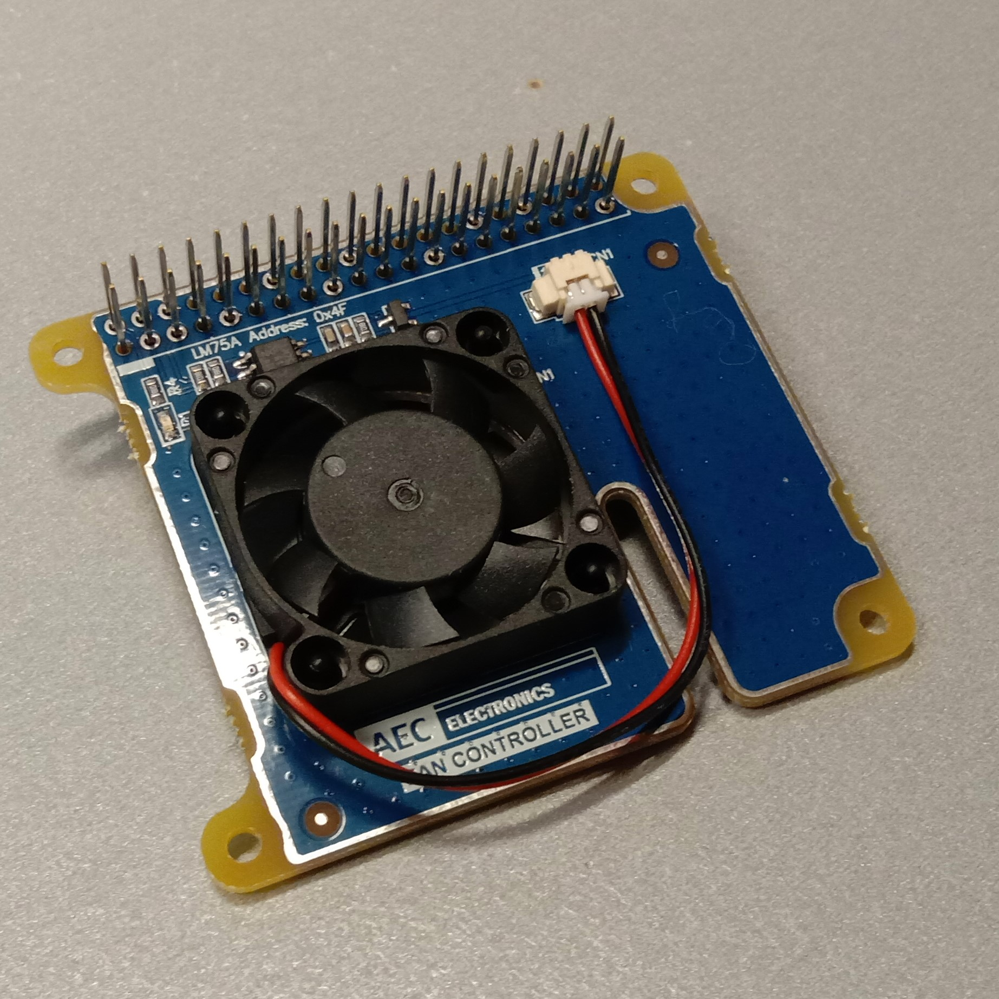
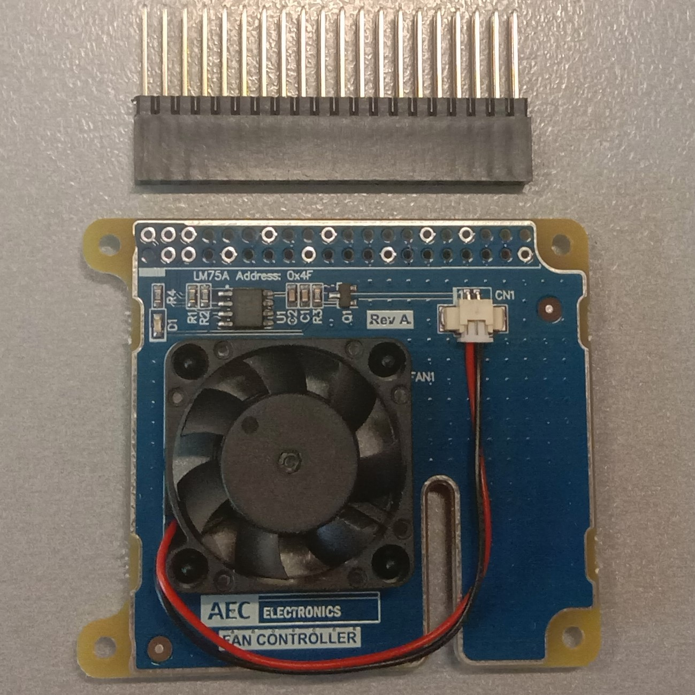
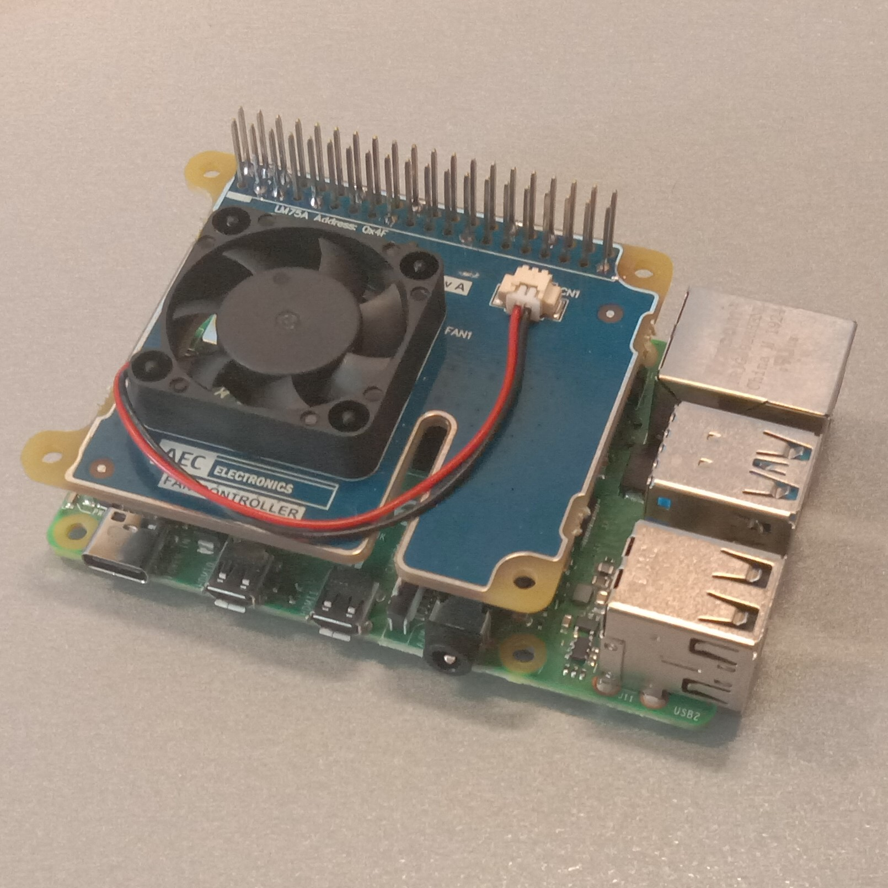

# AEC Electronics Fan Controller

This fan controller uses an LM75A to control a fan to cool a Raspberry Pi when it reaches a certain temperature. The LM75A is configured with a over temperature set point, and a lower return to normal temperature. The LM75A communicates with the Raspberry Pi on the I2C bus and its address is 0x4F.




## Installation

### Hardware

The fan controller is supplied with a 40pin extension header:



Fit the fan controller to the Raspberry Pi as shown:



It is recommended that standoffs are used to support the fan controller PCB.


### Software

1) Ensure that the I2C bus is enabled on the Raspberry Pi.
2) Clone this repository to the /home/pi directory
````bash
git clone https://github.com/Crazy-Guy/aec-fan-controller.git
````
3) Run the installation script to install a service that will configure the fan controller each time the Raspberry Pi is started. This service simply runs the _aec-fan-controller-init.sh_ script once on startup.
````bash
cd aec-fan-controller
bash install.sh
````

## Operation

### Reading the temperature

The _get-temp.sh_ script will read the temperature from the LM75A on the Fan Controller PCB, and the CPU and GPU within the Raspberry Pi.

````bash
cd aec-fan-controller
bash get-temp.sh
````

It will return the temperatures and the fan set points:

````bash
AEC Electronics Fan Controller
Temperature Sensor:  23.73*C
Fan ON Temperature:  24.00*C
Fan OFF Temperature: 20.00*C
GPU Temperature:     28.9'C
CPU Temperature:     28*C
````

### Setting the fan set and reset temperatures

The _set-temp.sh_ script is used to send the fan-on and fan-off temperatures to the LM75A over the I2C bus.
- The first parameter is the fan-on temperature (set-point)
- The second parameter is the fan-off temperature (reset-point)
- If no parameters are given, the defaults are 24'C and 20'C
- The fan-on temperature must be higher than the fan-off temperature.

Example showing a set-point of 30'C and a reset-point of 22'C:
````bash
./set-temp.sh 30 22
````

### Configuring the set and reset temperatures used on startup

To make changes to the set and reset points used on startup, edit the _aec-fan-controller-init.sh_ file:
````bash
#!/bin/bash

# Turn the fan on over 24*C
# Turn the fan off under 20*C
./set-temp.sh 24 20
````

