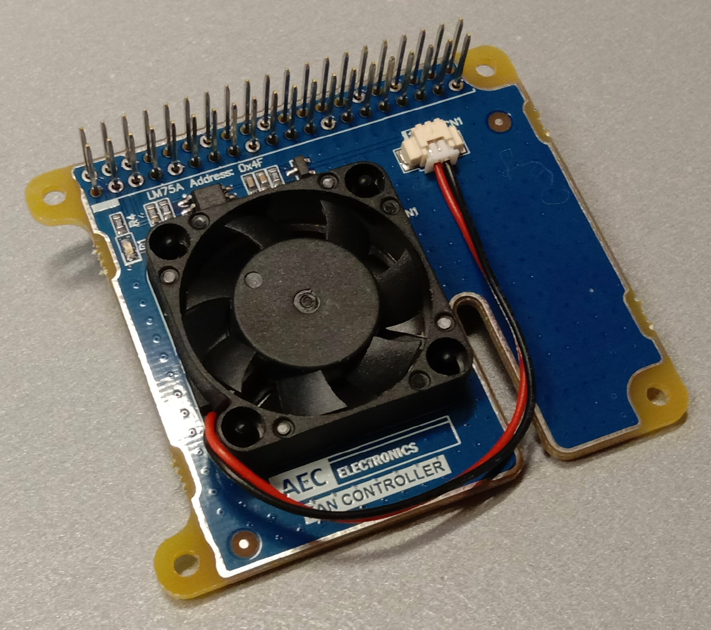

# AEC Electronics Fan Controller




## Installation

1) Clone this repository to the /home/pi directory
````bash
git clone https://github.com/Crazy-Guy/aec-fan-controller.git
````
2) Run the installation script
````bash
cd aec-fan-controller
bash install.sh
````

## Operation

The _get-temp.sh_ script will read the temperature from the LM75A on the Fan Controller PCB, and the CPU and GPU within the Raspberry Pi.

````bash
cd aec-fan-controller
bash get-temp.sh
````

It will return the temperatures and the fan set points:

````bash
AEC Electronics Fan Controller
Temperature Sensor:  23.73*C
Fan ON Temperature:  24.00*C
Fan OFF Temperature: 20.00*C
GPU Temperature:     28.9'C
CPU Temperature:     28*C
````

The LM75A is configured for address 0x4F.
